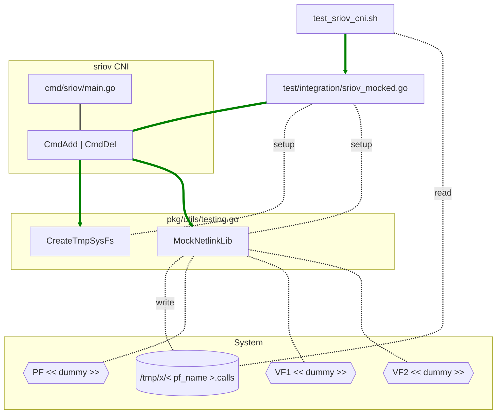

# Integration tests

This folder contains tests and related tools to run integration test suite. These tests leverages a mocked version of the cni, which runs with a 
fake, programmed version of the `/sys` filesystem and a mocked version of `NetlinkLib`. Both are implemented in `pkg/utils/testing.go`.

The following diagram describes the interactions between the components. 

Test cases in this directory are based on the https://github.com/pgrange/bash_unit framework.
